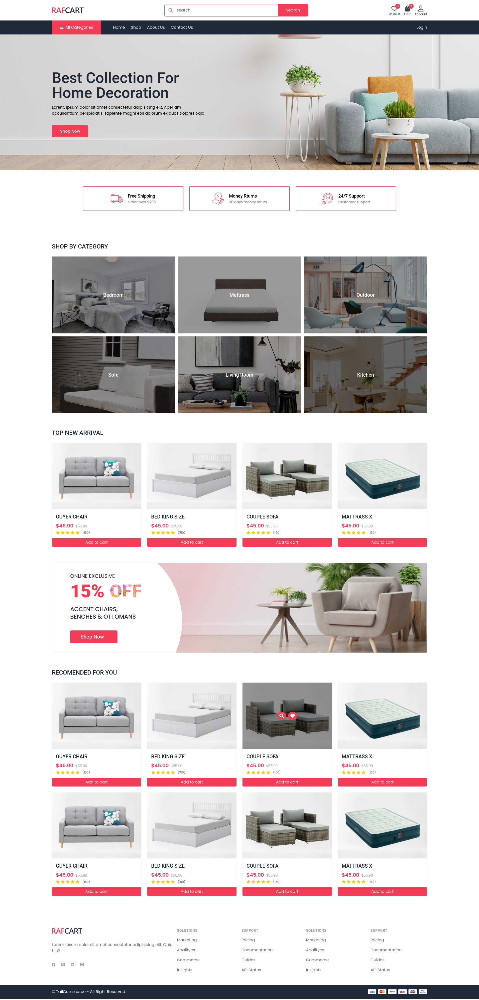
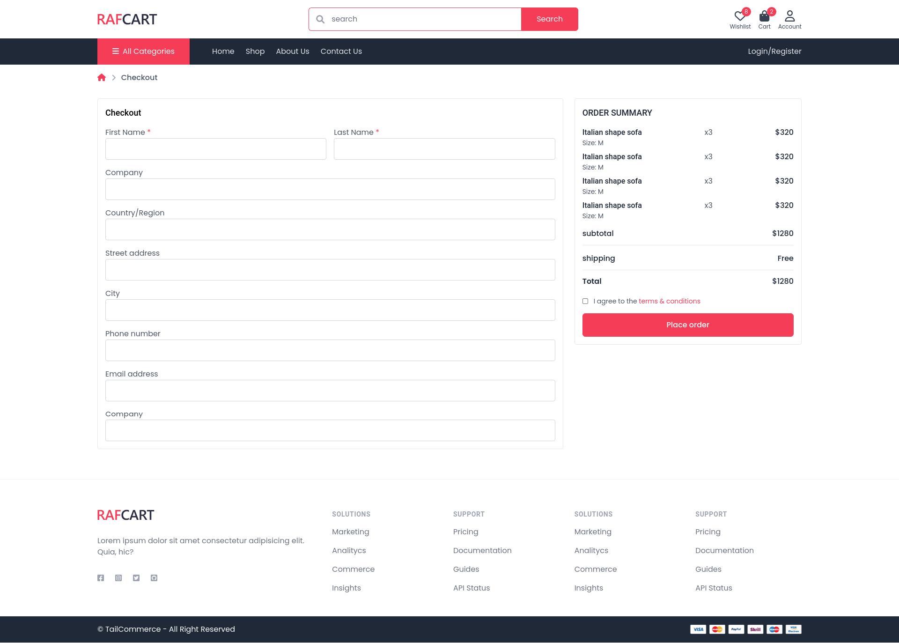
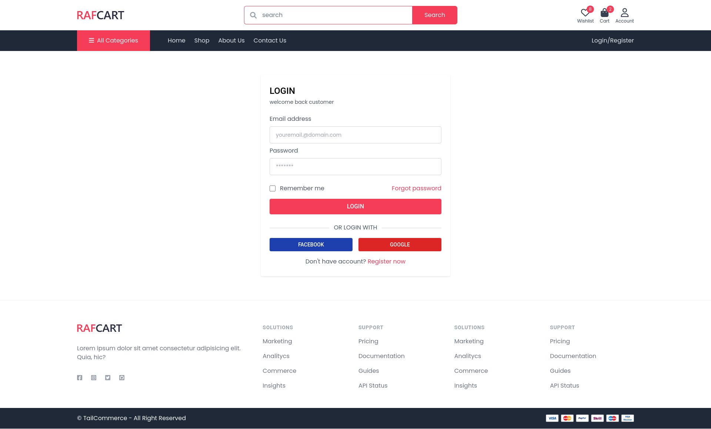
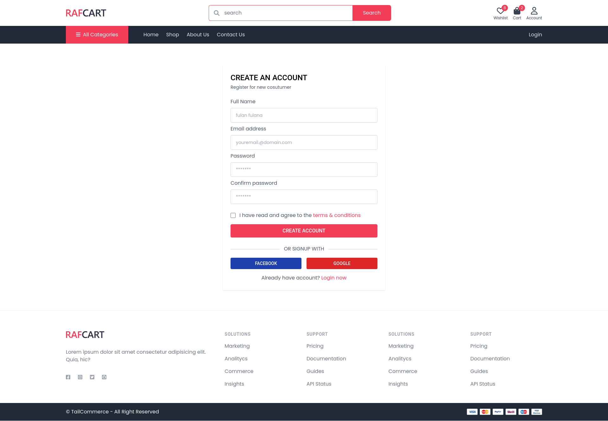

#cb95e5 
#5a69bb 
#5a77bb 
#725abb 
#965abb 
#bd8adb 
#ba99ff 

linear-gradient(90deg,#7209d4,#2832d4 33%,#00a5b2) 
(90deg,#ffabab,#bb61ff 66%); 
(90deg,#ba99ff,#abd8ff 50%,#8bfaeb); 


choose a font from this :
https://fonts.google.com/


button : 

background: linear-gradient(#0ab5fc, #1f62ed) padding-box, linear-gradient(180deg, #dff8ff, #dff8ff) border-box;


# how to run :


go to terminal and type 

```
    npm install
    
    npm run watch
```


## About The Project



Ecommerce Tailwind project.

## Screenshots

<details>
<summary>Homepage</summary>


</details>

<details>
<summary>Account</summary>


</details>

<details>
<summary>Checkout</summary>



</details>

<details>
<summary>Login</summary>



</details>

<details>
<summary>Register</summary>



</details>

<details>
<summary>Shop</summary>


</details>

<details>
<summary>Product</summary>


</details>

<details>
<summary>Wishlist</summary>


</details>
